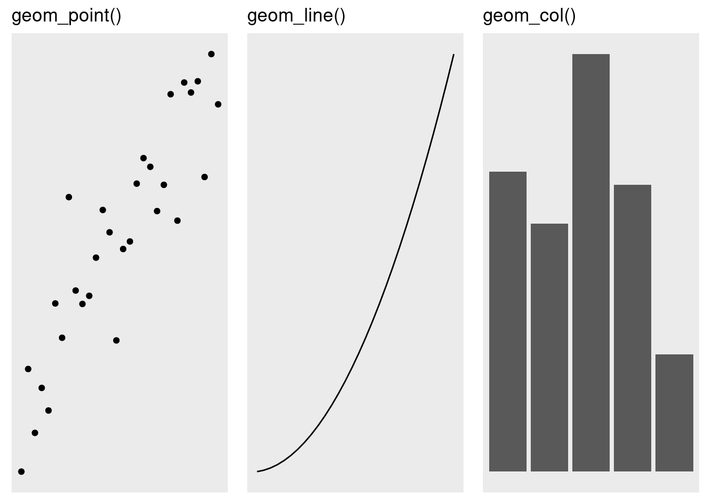
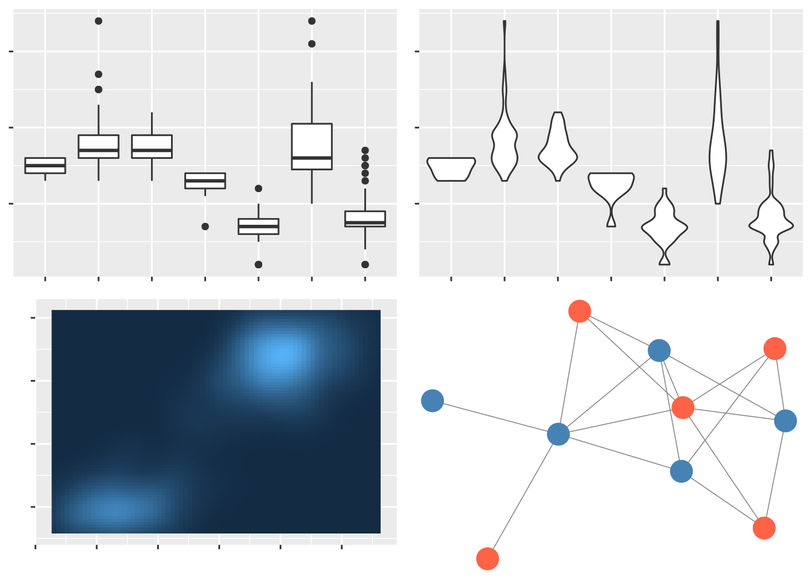
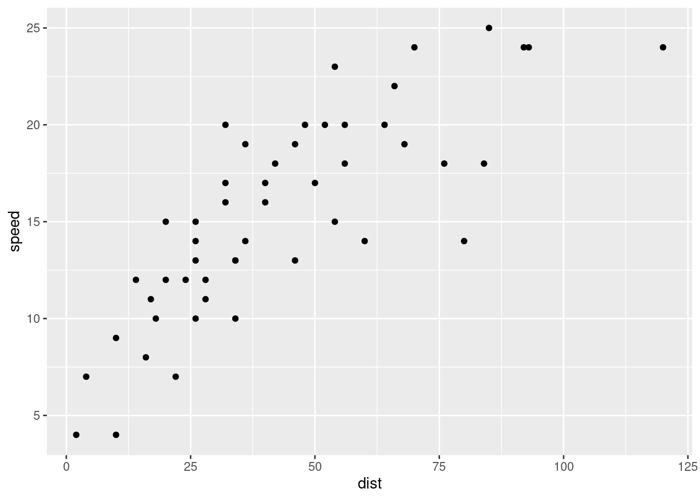

<style>
body {
text-align: justify}
</style>

# Visualización de datos con ggplot2

Comprender los tipos de gráficos y los principios básicos de la gramática de los gráficos. Cree sus primeras visualizaciones con el paquete ggplot2 que incluye diagramas de dispersión, gráficos de líneas y gráficos de barras.

## Por qué es importante la visualización de datos

La visualización de datos no solo es importante para comunicar los resultados, sino también una técnica poderosa para el análisis exploratorio de datos. Cada tipo de diagrama, como diagramas de dispersión, gráficos de líneas, gráficos de barras e histogramas, tiene su propio propósito y se puede aprovechar de una manera poderosa utilizando el paquete **ggplot2**.

- Comprender los diferentes roles de la visualización de datos.
- Comprender los diferentes tipos de parcelas disponibles.
- Obtenga una descripción general del paquete **ggplot2**.



### Introducción a la visualización de datos

> **Una imagen vale mas que mil palabras**.

La visualización de datos es la técnica más rápida y poderosa para comprender información nueva y existente. Durante una fase de exploración inicial, los científicos de datos intentan revelar las características subyacentes de un conjunto de datos, como diferentes distribuciones, correlaciones u otros patrones visibles. Este proceso también se denomina *análisis exploratorio de datos* (EDA) y marca el punto de partida de cada proyecto de ciencia de datos.

Los gráficos producidos durante la EDA muestran al científico de datos las direcciones del viaje por delante. Los patrones revelados pueden inspirar hipótesis sobre los procesos subyacentes, las características del conjunto de datos que se extraerán o las técnicas de modelado que se probarán. Por último, pero no menos importante, las visualizaciones descubren valores atípicos y errores de datos de los que el científico de datos debe ocuparse.

El papel más importante de la visualización de datos es la comunicación de los hallazgos de la ciencia de datos a colegas y clientes a través de presentaciones, informes o paneles. El esfuerzo utilizado para la EDA y las visualizaciones es un tiempo bien invertido, ya que los resultados se pueden utilizar directamente para comunicar los hallazgos.

### Tipos de gráficas disponibles
Hay muchos tipos de gráficos disponibles que ayudan a comprender las diferentes características y relaciones en el conjunto de datos.

Durante la fase de análisis de datos exploratorios, normalmente queremos detectar los patrones más obvios observando cada variable de forma aislada o detectando relaciones de variables con otras. El tipo de gráfico utilizado también está determinado por el tipo de datos de las variables de entrada, como numéricas o categóricas.

#### Gráfico de dispersión

Los gráficos de dispersión se utilizan para visualizar la relación entre dos variables numéricas. La posición de cada punto representa el valor de las variables en los ejes *x* e *y*.


#### Gráficos lineales

Los gráficos de líneas se utilizan para visualizar la trayectoria de una variable numérica contra otra que están conectadas a través de líneas. Son muy adecuados si los valores solo cambian **continuamente**, como la temperatura con el tiempo.


#### Gráficos de barras e histogramas

Los gráficos de barras visualizan valores `numéricos` agrupados por categorías. Cada categoría está representada por una barra con una altura definida por cada valor `numérico`. Los histogramas son gráficos de barras específicos para resumir el número de apariciones de valores numéricos en un conjunto de rangos de valores (o bins). Suelen utilizarse para determinar la *distribución* de valores numéricos.


#### Otros

Otros tipos de gráficos de uso frecuente en la ciencia de datos incluyen:

- **Diagramas de caja**: Muestra información de distribución de valores numéricos agrupados en categorías como cajas. Genial para comparar rápidamente múltiples distribuciones.
- **Gráficos de violín**: igual que los gráficos de caja, pero muestran distribuciones como *violines*.
- **Mapas de calor**: muestran las interacciones de las variables, generalmente correlaciones, como imágenes rasterizadas que resaltan áreas de alta interacción.
- **Gráficos de red**: muestra conexiones entre nodos



### Presentamos: ggplot2

Debido a la importancia de la visualización para la ciencia de datos y las estadísticas, R ofrece un amplio conjunto de herramientas y paquetes. El lenguaje R básico ya proporciona un rico conjunto de funciones de trazado y tipos de trazado. Estas funciones de trazado requieren que los usuarios especifiquen cómo trazar cada elemento en el lienzo paso a paso. Por el contrario, el paquete **ggplot2** permite la especificación de trazados a través de un conjunto de *capas* de trazado. Esto requiere que el paquete averigüe los pasos necesarios para producir el gráfico.

A través del conjunto predefinido de capas geométricas, facetas y temas, **ggplot2** permite a los usuarios crear hermosos gráficos en muy poco tiempo. **ggplot2** es también la biblioteca de trazado más adoptada en la comunidad R.

## Crea un diagrama de dispersión con ggplot

Realice sus primeros pasos con el paquete **ggplot2** para crear un diagrama de dispersión. Utilice la gramática de los gráficos para asignar los atributos del conjunto de datos a su gráfico y conectar diferentes capas con el operador `+`.

- Defina un conjunto de datos para la gráfica usando la función `ggplot()`
- Especifique una capa geométrica usando la función `geom_point()`
- Asigne los atributos del conjunto de datos a las propiedades de trazado usando el parámetro de `mapping`
- Conectar diferentes objetos `ggplot` usando el operador `+`

```{r, eval=FALSE}
library(ggplot2)
ggplot(___) + 
  geom_point(
    mapping = aes(x = ___, y = ___)
  )
```

### Introducción a los gráficos de dispersión
Los diagramas de dispersión utilizan puntos para visualizar la relación entre dos variables numéricas. La posición de cada punto representa el valor de las variables en los ejes X e Y. Veamos un ejemplo de un diagrama de dispersión para comprender la relación entre la *speed* y la *distancia de frenado* de los automóviles:



Cada punto representa un automóvil. Cada automóvil comienza a frenar a una velocidad dada en el eje-y y recorre la distancia que se muestra en el eje-x hasta detenerse por completo. Si echamos un vistazo a todos los puntos de la trama, podemos ver claramente que los coches más rápidos necesitan más distancia para  detenerse por completo.

### Especificar un conjunto de datos

Para crear gráficos con **ggplot2**, primero debe cargar el paquete usando la `library(ggplot2)`.

Una vez que se haya cargado el paquete, especifique el conjunto de datos que se utilizará como argumento de la función `ggplot()`. Por ejemplo, para especificar una gráfica usando el conjunto de datos de `cars`, puede usar:

```{r}
library(ggplot2)
library(gapminder)
ggplot(cars)
```

Tenga en cuenta que este comando no traza nada más que un lienzo gris todavía. Simplemente define el conjunto de datos para el gráfico y crea una base vacía sobre la cual podemos agregar capas adicionales.

### Especificando una capa geométrica

Podemos usar las capas geométricas de **ggplot** (o *geoms*) para definir cómo queremos visualizar nuestro conjunto de datos. Las *geoms* utilizan objetos geométricos para visualizar las variables de un conjunto de datos. Los objetos pueden tener múltiples formas como puntos, líneas y barras y se especifican mediante las funciones correspondientes `geom_point()`, `geom_line()` y `geom_col()`:


### Creando mapeos estéticos

**ggplot2** utiliza el concepto de *estética*, que *asigna* los atributos del conjunto de datos a las características visuales de la gráfica. Cada capa geométrica requiere un conjunto diferente de *asignaciones estéticas*, p. Ej. la función `geom_point()` usa la estética `x` e `y` para determinar las coordenadas de los ejes `x` e `y` de los puntos a graficar. La estética se asigna dentro de la función `aes()` para construir las asignaciones finales.

Para especificar una capa de puntos que traza la velocidad variable en el eje-x y la distancia `dist` en el eje-y, podemos escribir:

```{r, eval=FALSE}
geom_point(
  mapping = aes(x=speed, y=dist)
)
```

La expresión anterior construye una capa geométrica. Sin embargo, esta capa actualmente no está vinculada a un conjunto de datos y no produce una gráfica. Para **vincular** la capa con un objeto `ggplot` que especifica el conjunto de datos de `cars`, necesitamos conectar el objeto `ggplot(cars)` con la capa `geom_point()` usando el operador `+`:

```{r}
ggplot(cars) + 
  geom_point(
    mapping = aes(x=speed, y=dist)
  )
```

A través del enlace, `ggplot()` sabe que las variables de `speed` y `dist` asignadas se toman del conjunto de datos de `cars`. `geom_point()` instruye a ggplot para trazar las variables mapeadas como puntos.

Los pasos necesarios para crear un diagrama de dispersión con `ggplot` se pueden resumir de la siguiente manera:

1. Cargue el paquete **ggplot2** usando `library(ggplot2)`.
2. Especifique el conjunto de datos que se graficará usando `ggplot()`.
3. Utilice el operador `+` para agregar capas al gráfico.
4. Agregue una capa geométrica para definir las formas que se graficaran. En caso de gráficos de dispersión, use `geom_point()`.
5. Asigne variables del conjunto de datos a propiedades de trazado a través del parámetro de `mapping` en la capa geométrica.


## Especificar estética adicional para puntos

**ggplot2** implementa la gramática de gráficos para mapear atributos de un conjunto de datos para trazar características a través de la estética. Este marco se puede utilizar para ajustar el `tamaño de punto`, el `color` y la transparencia `alpha` de los puntos en un diagrama de dispersión.

- Agregue dimensiones de trazado adicionales a través de la estética
- Ajuste el tamaño del punto de un gráfico de dispersión usando el parámetro `size`
- Cambiar el color del punto de un diagrama de dispersión usando el parámetro `color`
- Establecer un parámetro `alpha` para cambiar la transparencia de todos los puntos
- Diferenciar entre mapeos estéticos y parámetros constantes

```{r, eval=FALSE}
ggplot(___) + 
  geom_point(
    mapping = aes(x = ___, y = ___, 
                  color = ___, 
                  size  = ___),
    alpha  = ___
  )
```

### Añadiendo más estética a la trama

En su forma más básica, los diagramas de dispersión solo pueden visualizar conjuntos de datos en dos dimensiones a través de la estética `x` e `y` de la capa `geom_point()`. Sin embargo, la mayoría de los conjuntos de datos tienen más de dos variables y, por lo tanto, pueden requerir dimensiones de trazado adicionales. `ggplot()` hace que sea muy fácil mapear variables adicionales a diferentes estéticas de trazado como `size`, transparencia `alpha` y `color`.

Consideremos el conjunto de datos `gapminder_2007` que contiene las variables PIB per cápita `gdpPercap` y esperanza de vida `lifeExp` para 142 países en el año 2007:

```{r}
library(tidyverse)
library(gapminder)
## select data
gapminder_2007 <- gapminder%>%
  filter(year == 2007)
```


```{r}
ggplot(gapminder_2007) + 
  geom_point(aes(x = gdpPercap, y = lifeExp))
```

Al mapear la variable `continent` a través de la estética del `color` del punto y la población `pop` (en millones) a través del tamaño del punto `size`, obtenemos una gráfica mucho más rica que incluye 4 variables diferentes del conjunto de datos:


### Ajuste del color del punto
Normalmente, el color del punto se utiliza para introducir una nueva dimensión en un diagrama de dispersión. En ggplot usamos la estética del `color` para especificar el mapeo de una variable al color de los puntos.

Para el conjunto de datos `gapminder_2007` podemos trazar el PIB per cápita `gdpPercap` frente a la esperanza de vida `lifeExp` de la siguiente manera:

```{r}
ggplot(gapminder_2007) + 
  geom_point(aes(x = gdpPercap, y = lifeExp))
```


Para colorear cada punto en función del `continent` de cada país podemos utilizar:

```{r}
ggplot(gapminder_2007) + 
  geom_point(aes(x = gdpPercap, y = lifeExp,
                 color = continent))
```

Vemos que en la trama resultante cada punto está coloreado de manera diferente según el `continent` de cada país. `ggplot` usa el esquema de coloración basado en el tipo de datos categóricos de la variable `continent`.

Por el contrario, veamos cómo se ve el gráfico si coloreamos los puntos por el `pop` de población de la variable `numeric`:

```{r}
ggplot(gapminder_2007) + 
  geom_point(aes(x = gdpPercap, y = lifeExp,
                 color = pop))
```

La escala cambia inmediatamente a continua como se puede ver en la leyenda y los puntos celestes son ahora los países con mayor número de población (China e India).

### Ajustar el tamaño del punto
Para el conjunto de datos de `gapminder_2007` podemos trazar el PIB per cápita `gdpPercap` frente a la esperanza de vida de la siguiente manera:

```{r}
ggplot(gapminder_2007) + 
  geom_point(aes(x = gdpPercap, 
                 y = lifeExp))
```

Para ajustar el tamaño de puntos en función de la población (`pop`) de cada país, podemos usar:

```{r}
ggplot(gapminder_2007) + 
  geom_point(aes(x = gdpPercap, y = lifeExp,
                 size = pop))
```

Vemos que los tamaños de puntos en el gráfico anterior no reflejan claramente las diferencias de población en cada país. Si comparamos el tamaño en puntos que representa una población de 250 millones de personas con el que muestra 750 millones, podemos ver que sus tamaños no son proporcionales. En su lugar, los tamaños en puntos están agrupados de forma predeterminada. Para reflejar las diferencias de población reales por el tamaño de puntos, podemos usar la función `scale_size_area()` en su lugar. La información de escala se puede agregar como cualquier otro objeto ggplot con el operador `+`:

```{r}
ggplot(gapminder_2007) + 
  geom_point(aes(x = gdpPercap, y = lifeExp,
                 color = continent,
                 size = pop)) + 
  scale_size_area(max_size = 10)
```

Tenga en cuenta que hemos ajustado el tamaño del punto con `max_size`, lo que da como resultado tamaños de punto más grandes.

### Establecer la estética global: transparencia
Trazar muchos puntos con coordenadas X e Y similares en un gráfico puede producir nubes de puntos densas. Muchos puntos en estas nubes están sobretrazados y el número real de observaciones en un área determinada ya no es visible. Como solución, podemos establecer la transparencia de cada punto usando el parámetro ggplot `alpha`.

Dado que **no** queremos establecer la transparencia del punto **individualmente** para cada punto sino **globalmente** para todos los puntos, no establecemos el parámetro `alpha` como un mapeo estético (dentro de `aes()`) sino fuera.

Establecemos la **opacidad** de cada punto al 50% a través del parámetro `alpha` **outside** como parámetro constante:

```{r}
ggplot(gapminder_2007) + 
  geom_point(aes(x = gdpPercap, y = lifeExp, size = pop), 
             alpha = 0.5)
```

Ahora podemos ver claramente cuántos puntos se superponen entre sí y la opacidad de cada punto se establece en `0.5`.

## Crea un gráfico de líneas con ggplot

Use la estética `geom_line()` para dibujar gráficos de líneas y personalizar su estilo usando el parámetro `color`. Especifique qué coordenadas usar para cada línea con el parámetro `group`.

- Crea tu primer gráfico de línea usando `geom_line()`
- Defina cómo se conectan las diferentes líneas mediante el parámetro `group`
- Cambiar el color de línea de un gráfico de líneas usando el parámetro `color`

```{r, eval=FALSE}
ggplot(___) + 
  geom_line(
    mapping = aes(x = ___, y = ___, 
                  group = ___, 
                  color = ___)
)
```


### Introducción a los gráficos lineales

Los gráficos de líneas se utilizan para visualizar la trayectoria de una variable numérica contra otra. A diferencia de los diagramas de dispersión, las coordenadas `x` e `y` no se visualizan a través de puntos, sino que están conectadas a través de líneas. Los gráficos de líneas se utilizan con mayor frecuencia si una variable cambia *continuamente* contra otra variable numérica, como es el caso de la mayoría de los gráficos de series de tiempo (por ejemplo, precios, clientes, concentración de CO2, temperatura a lo largo del tiempo), funciones continuas (por ejemplo, sinusoidal (x)) u otras relaciones casi continuas (curvas de oferta/demanda del mundo real).


### Crear un gráfico lineal simple
Japón se encuentra entre los países con mayor esperanza de vida. Utilizando el conjunto de datos `gapminder_japan`, determinamos cómo se ha desarrollado la esperanza de vida en Japón a lo largo del tiempo. Necesitamos que:

1. Especifique el conjunto de datos dentro de `ggplot()`
2. Definir la capa de trazado `geom_line()`
3. Asigne el `year` al eje x y la esperanza de vida `lifeExp` al eje y con la función `aes()`

Tenga en cuenta que la biblioteca **ggplot2** debe cargarse primero con `library(ggplot2)`.

```{r}
library(ggplot2)
gapminder_japan <- gapminder %>%
  filter(country == "Japan")
## gráfica
ggplot(gapminder_japan) + 
  geom_line(
    mapping = aes(x = year, y = lifeExp)
)
```

### Agregar más líneas

Hasta ahora solo nos hemos centrado en líneas simples, pero ¿qué pasa si tenemos varios países en el conjunto de datos y queremos diferenciarlos de alguna manera?

Los gráficos de líneas a menudo se amplían y se utilizan para comparar dos o más líneas. Los gráficos de líneas múltiples muestran las diferencias absolutas entre las observaciones, pero también cómo las trayectorias específicas se relacionan entre sí. Por ejemplo, respondamos a la pregunta: *¿Cómo ha cambiado la esperanza de vida en los países Austria y Hungría a lo largo del tiempo?*

Primero filtramos el conjunto de datos para ambos países de interés. Luego, establecemos la variable `country` como argumento de `group` para el mapeo estético. El argumento de grupo le dice a ggplot qué observaciones pertenecen juntas y deben conectarse a través de líneas. Al especificar la variable `country`, ggplot crea una línea separada para cada país. Para que las líneas sean más fáciles de distinguir, también asignamos `color` a `country` para que cada línea de país tenga un color diferente.

```{r}
gapminder_comparison <- 
  filter(gapminder, country %in% c("Austria", "Hungary"))

ggplot(data = gapminder_comparison) + 
  geom_line(mapping = aes(x = year, y = lifeExp, 
                          group = country, 
                          color = country)
            )
```

Tenga en cuenta que ggplot también separa las líneas correctamente si solo se especifica la asignación `color` (el parámetro `group` se establece implícitamente).

## Crea tu primer gráfico de barras

- Crea tu primer gráfico de barras usando `geom_col()`
- Rellenar barras con color usando la estética `fill`

```{r, eval=FALSE}
ggplot(___) + 
  geom_col(
    mapping = aes(x = ___, y = ___, 
                  fill = ___)
 )
```

### Introducción a los gráficos de barras

Los gráficos de barras visualizan valores `numéricos` agrupados por categorías. Cada categoría está representada por una barra con una altura definida por cada valor `numérico`.

Los gráficos de barras son adecuados para comparar valores entre diferentes grupos, p. Ej. número de votos por partidos, número de personas en diferentes países o PIB per cápita en diferentes países. Los gráficos de barras son un poco espaciosos y funcionan mejor si el número de grupos a comparar es bastante pequeño.

A continuación, puede encontrar un ejemplo que muestra la cantidad de personas (en millones) en los cinco países más grandes por población en 2007:


### Crear un gráfico de barras simple

En **ggplot2**, los gráficos de barras se crean utilizando la capa geométrica `geom_col()`. La capa `geom_col()` requiere el mapeo estético `x` que define las diferentes barras a trazar. La altura de cada barra está definida por la variable especificada en el mapeo estético `y`. Ambas asignaciones, `x` e `y`, son necesarias para `geom_col()`.

Creemos nuestro primer gráfico de barras con el conjunto de datos `gapminder_top5`. Contiene datos de población (en millones) y esperanza de vida de los países más grandes por población en 2007.

```{r}
gapminder_top5 <- gapminder %>%
  filter(year == 2007) %>%
  slice_max(pop, n=5)
```

```{r}
ggplot(gapminder_top5) + 
  geom_col(aes(x = country, y = pop))
```

Vemos que las barras resultantes están ordenadas por los nombres de los países en orden alfabético por defecto.

### Llenado de barras de color

Al igual que otras geoms, `geom_col()` permite a los usuarios asignar variables de conjuntos de datos adicionales al atributo de color de la barra. La estética `fill` se puede utilizar para llenar de color todas las barras. Una confusión habitual es la estética `color` que especifica el color de la *línea* del borde de cada barra en lugar del color `fill`.

Según el conjunto de datos `gapminder_top5`, trazamos la población (en millones) de los países más grandes y usamos la variable `continent` para colorear cada barra:

```{r}
ggplot(gapminder_top5) + 
  geom_col(aes(x = country, y = pop, fill = continent))
```

Dado que la variable `continent` es una variable categórica, las barras tienen un esquema de color claro para cada continente. Veamos qué sucede si usamos una variable `numérica` como la esperanza de vida `lifeExp` en su lugar:

```{r}
ggplot(gapminder_top5) + 
  geom_col(aes(x = country, y = pop, fill = lifeExp))
```


Los colores de las barras ahora han cambiado según la leyenda **continua** de la derecha. Vemos que también se pueden utilizar variables `numéricas` para `rellenar` barras.

### Gráficos de barras apiladas

En algunas circunstancias, puede resultar útil trazar múltiples variables de valores numéricos dentro de cada barra. Los ejemplos son valores numéricos que describen una entidad específica (por ejemplo, clientes) dividida entre varias categorías (segmentos de clientes) de modo que la altura de la barra representa el número total (todos los clientes).

El siguiente gráfico muestra la cantidad de teléfonos (en miles) por continente desde 1956 hasta 1961 como un gráfico de barras apiladas:

```{r}
## Ordenando la base de dato
world_phones <- WorldPhones %>%
  as.data.frame() %>%
  rownames_to_column("Year") %>%
  pivot_longer(cols=-Year, names_to="region", values_to="phones") %>%
  filter(Year >1955)
```

```{r}
ggplot(world_phones) + 
  geom_col(aes(x = Year, y = phones,
               fill = region))
```


