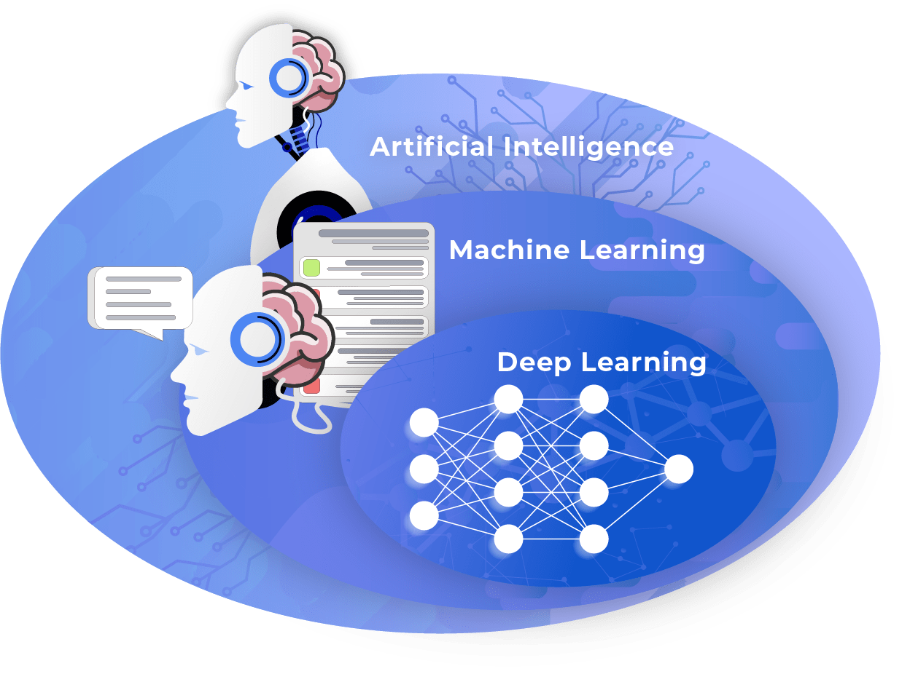
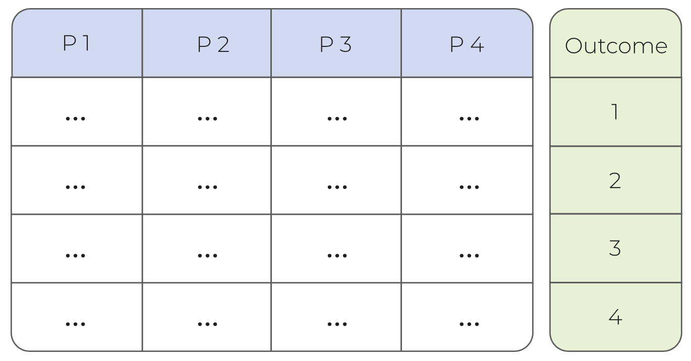
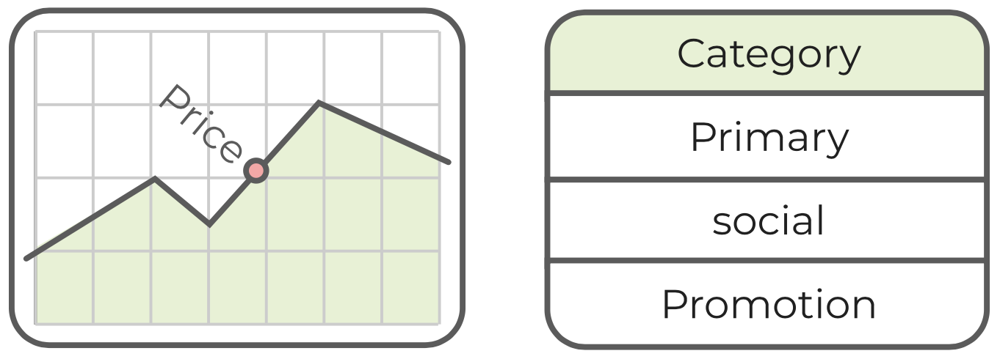
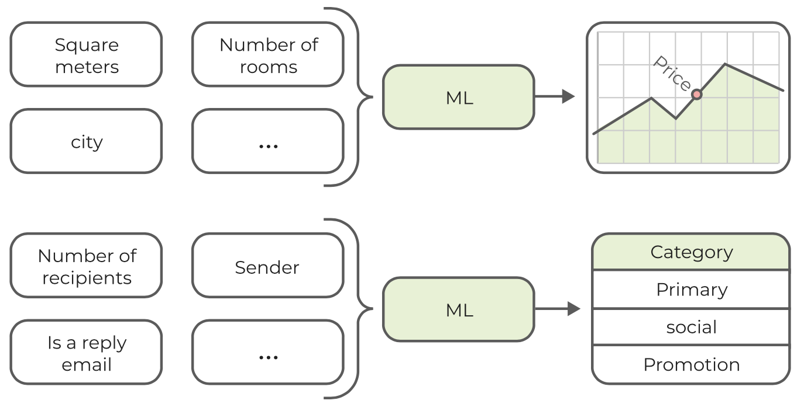

# Introducción a Machine Learning

Aprenda los fundamentos del aprendizaje automático, incluidos casos de uso y diferentes técnicas de aprendizaje. Diferenciar entre regresión y clasificación.

¿Qué es Machine Learning?

En los últimos años, términos como inteligencia artificial, aprendizaje automático y aprendizaje profundo se han utilizado mucho. Tan misteriosas como suenan estas palabras, ¿cuál es su diferencia y de qué son capaces?

-   Diferenciar entre inteligencia artificial, aprendizaje automático y aprendizaje profundo
-   Identificar casos de uso de Machine Learning

## Inteligencia artificial

La **inteligencia artificial (IA)** es la inteligencia demostrada por las máquinas, en contraste con la inteligencia natural asociada con los humanos. Por inteligencia, generalmente nos referimos a la resolución de problemas y tareas complejos, que aparentemente requieren algún tipo de habilidades cognitivas. La inteligencia artificial comenzó como una disciplina académica en la década de 1950 con el supuesto de que las computadoras pueden imitar el complejo razonamiento dentro del cerebro humano. Este campo también se conoce como *inteligencia artificial general (AGI)* y el objetivo de alcanzar una inteligencia similar a la humana, incluso hoy, parece estar fuera de alcance.

Sin embargo, surgió un subcampo llamado aprendizaje automático *machine learning (ML)* que se centra en problemas más específicos, como el reconocimiento de imágenes o la comprensión del lenguaje. Gracias a las aplicaciones de la industria, el aprendizaje automático se ha vuelto cada vez más popular y atrae a investigadores e inversores a nivel mundial.

## Machine Learning (Aprendizaje automático)

El **machine learning (ML)** es un subcampo de la inteligencia artificial. Su objetivo es construir y aplicar modelos sofisticados sin la necesidad de reglas e instrucciones codificadas. En cambio, los modelos pueden extraer reglas y patrones de los datos y aplicarlos para nuevos problemas.

La recopilación de datos, la anotación y el procesamiento previo son requisitos previos esenciales para crear modelos de aprendizaje automático. Como regla general, cuanto mayor es la complejidad de un modelo, normalmente se necesitan más datos para el entrenamiento y la validación.

Por ejemplo, podría pensar en asistentes virtuales avanzados, como [Alexa](https://developer.amazon.com/alexa) (Amazon) o [Siri](https://www.apple.com/siri) (Apple), que aplican el aprendizaje automático para interpretar el lenguaje natural y predecir la mejor respuesta o reacción.

## Aprendizaje profundo (Deep Learning)

El **aprendizaje profundo** es un área del aprendizaje automático, que cubre únicamente las redes neuronales. El nombre de red neuronal se inspiró en el hecho de que la arquitectura modela libremente el cerebro humano. Esta técnica demostró ser especialmente adecuada para ciertas tareas como el reconocimiento de imágenes, que es la piedra angular de aplicaciones como los vehículos autónomos.

Las redes neuronales profundas son actualmente el área de investigación más candente en toda la comunidad de IA. Su popularidad se basa en muchos avances en los últimos años, incluida la competencia ImageNet que clasifica imágenes en color de alta resolución en 1000 categorías diferentes y 1,2 (1,4) millones de muestras de entrenamiento. Las redes neuronales profundas también llevaron a avances en otras áreas en las que se desempeñaron comparables o incluso mejores que sus contrapartes humanas, incluido el reconocimiento de voz, la transcripción de escritura a mano (OCR), la traducción automática, la conducción autónoma, Go playing y muchos más.

## Casos de uso populares

A medida que avanzaba el campo del aprendizaje automático y las computadoras se volvían cada vez más poderosas, se habilitaron nuevas soluciones que afectaron a casi todos los campos (científicos). Hoy en día, el aprendizaje automático ayuda a los científicos a realizar diagnósticos médicos, descubrir nuevos medicamentos, monitorear la superficie de la tierra y detectar incendios forestales, automatizar y optimizar procesos en la industria financiera, etc.

Aparte de estas aplicaciones de vanguardia, a menudo tendemos a pasar por alto que el aprendizaje automático también forma parte de nuestra vida diaria. En las siguientes secciones abordaremos estas aplicaciones de aprendizaje automático y nos centraremos en sistemas como:

-   Sistemas de recomendación
-   Los motores de búsqueda
-   Máquina traductora
-   Identificación de música
-   Autos autónomos

### Caso de uso: motores de búsqueda y sistemas de recomendación

Los **motores de búsqueda**, como Google, aplican el aprendizaje automático de muchas formas para brindar mejores servicios. Al escribir una consulta, por ejemplo, el aprendizaje automático proporciona sugerencias de autocompletado. Estas sugerencias se personalizan en función de los temas de tendencia actual, pero también de nuestra ubicación y búsquedas anteriores. Posteriormente, las consultas se evalúan en muchos niveles para determinar nuestras intenciones exactas y clasificar los resultados en consecuencia.

De manera similar, el aprendizaje automático determina lo que se nos recomienda en YouTube, Netflix, Amazon, etc. (un campo del aprendizaje automático, a menudo denominado **sistemas de recomendación**). Estas aplicaciones predicen nuestros intereses al analizar nuestras actividades en línea. Los artículos que hemos buscado, las películas que hemos visto, los productos que hemos comprado son todos predictores sobre nuestro comportamiento e intereses futuros.

### Caso de uso: traducción automática

Los servicios de **traducción** como [DeepL](https://www.deepl.com/en/translator) también aplican cada vez más el aprendizaje automático. La idea principal detrás de estos servicios es pasar de diccionarios simples a traductores complejos que se enfocan en el contexto e interpretan el texto como un todo. El aprendizaje automático en esta configuración se puede utilizar para crear modelos que describan cómo se expresan ciertas ideas en otros lenguajes. Esto permite una comprensión más matizada del texto escrito y proporciona traducciones más naturales. Un aspecto importante de estas soluciones es que se pueden mejorar constantemente proporcionándoles nuevos ejemplos y comentarios de los que aprender.

### Caso de uso: identificación de música y reconocimiento de voz

El análisis de audio es un campo propio en el aprendizaje automático. Una herramienta común en este campo es transformar señales de audio en componentes de frecuencia. En el caso de los discos de música, la composición de estos componentes de frecuencia es tan única, que podemos definir las llamadas *huellas digitales* para cada canción. Esto habilita aplicaciones de **identificación de música** como Shazam, que pueden identificar y unir canciones con precisión basándose en una muestra de solo unos segundos de duración. Del mismo modo, las aplicaciones de **reconocimiento de voz** pueden identificar fácilmente las palabras habladas y convertirlas en lenguaje escrito.

### Caso de uso: coches autónomos

Los **coches autónomos** como Google Waymo y Tesla dependen en gran medida del aprendizaje automático. Al analizar los datos provenientes de varios sensores, el aprendizaje automático controla la aceleración, frenado y dirección del automóvil. Estas instrucciones se basan no solo en las normas de tráfico y las señales de tráfico, sino que incluyen un modelo predictivo continuo para evitar posibles accidentes. Aunque los modelos finales de aprendizaje automático son capaces de evaluar los datos de entrada y tomar decisiones en fracciones de segundo, el entrenamiento de los modelos requiere inmensas cantidades de datos, poder computacional y tiempo.

## Técnicas de Machine Learning

En este capítulo

-   Familiarízate con diferentes enfoques de machine learning
-   Diferenciar entre técnicas de aprendizaje supervisado, no supervisado y por refuerzo.
-   Vea cómo se pueden aplicar las técnicas de aprendizaje para diferentes casos de uso

La idea básica del aprendizaje automático es crear modelos que se puedan utilizar para hacer predicciones y tomar decisiones. Diferenciamos entre 3 tipos de aprendizaje automático, cada uno de ellos tiene como objetivo resolver diferentes tipos de tareas: **supervisado**, **no supervisado** y **aprendizaje reforzado**.

El **aprendizaje supervisado** tiene como objetivo aprender de un conjunto de datos de ejemplo. Nuestra suposición inicial es que el valor de un resultado conocido (por ejemplo, el cliente compra un producto) está influenciado por un conjunto de entradas medibles (edad, intereses, últimos clics). Utilizando algoritmos de aprendizaje automático, intentamos detectar y modelar estas relaciones.

El **aprendizaje no supervisado** también requiere datos de entrada, pero no existe una variable de resultado predefinida. En su lugar, tratamos de detectar patrones y establecer relaciones dentro de los datos (por ejemplo, a través de agrupaciones) o reducir dimensiones (por ejemplo, con análisis de componentes principales).

El **aprendizaje reforzado** no requiere observaciones de entrada, sino un objetivo y un entorno en el que operar. Al integrar la retroalimentación continua del entorno, esperamos que el sistema cree sus propias tácticas para lograr el objetivo.

### Aprendizaje supervisado

En el *aprendizaje supervisado*, la variable de resultado debe conocerse para el entrenamiento de modelos. Como ejemplo, podría pensar en un modelo para la predicción de precios de apartamentos. Este modelo podría ayudar a los agentes inmobiliarios a fijar el precio de los nuevos apartamentos que ingresan al mercado. Además, los valores previstos se pueden comparar con los precios del mercado para determinar las oportunidades de compra de los apartamentos más infravalorados. Las variables de entrada requeridas para este problema probablemente incluirían aspectos como:

-   **Ciudad**: Ubicación del apartamento por ciudad.
-   **Habitaciones**: Número de habitaciones del apartamento.
-   **Tamaño**: Tamaño del apartamento por metros cuadrados.

Como punto de partida, necesitamos un conjunto de datos con varios ejemplos que contengan esta información:

### Aprendizaje supervisado: objetivo

El objetivo del aprendizaje automático supervisado es tomar un conjunto de ejemplos y entrenar un modelo utilizando métodos estadísticos. Este modelo debe explicar la relación entre las variables de entrada (por ejemplo, ciudad, habitaciones, tamaño) y la variable de salida (por ejemplo, precio) con la mayor precisión posible. Una vez que se ha entrenado el modelo, se puede utilizar para predecir el resultado de nuevas combinaciones de valores de entrada invisibles.

### Aprendizaje no supervisado

Las técnicas de aprendizaje no supervisadas extraen estructuras y patrones estadísticos de conjuntos de datos. A diferencia del aprendizaje supervisado, estas técnicas no requieren una variable de resultado predefinida en la que recibir entrenamiento.

El método de aprendizaje no supervisado más importante es la **agrupación** o cluster. La agrupación intenta agrupar las observaciones en función de su similitud. Primero, la similitud entre las observaciones se calcula como una distancia entre sí. Basándonos en estos valores, podemos determinar conglomerados (grupos) en los que las observaciones están más próximas entre sí.

#### Aprendizaje no supervisado: ejemplo

Los métodos de agrupación en clústeres se aplican a menudo como un intento de definir grupos de clientes que son similares. La similitud puede significar intereses coincidentes, datos demográficos, ubicación geográfica, etc. Esta aplicación se denomina segmentación de mercado. El objetivo de este caso de uso es comprender mejor la base de clientes y sus necesidades. Los clústeres se pueden utilizar para proporcionar anuncios y ofertas dirigidos a los clientes de acuerdo con sus propiedades. Como ejemplo, echemos un vistazo al siguiente gráfico:

 

Esta gráfica compara el `Annual Income` y `Spending Score` de algunos clientes de centros comerciales. Al aplicar un algoritmo de agrupación en clústeres y definir cinco grupos, podemos separar muy bien 5 tipos diferentes de clientes. Los grupos clave en este ejemplo serían el grupo azul y rojo, que generan la mayor cantidad de ingresos. Éstos definen dos tipos de clientes. Mientras que el grupo azul contiene clientes con ingresos más bajos, el grupo rojo contiene clientes con ingresos relativamente altos. Con base en esta información, se podría adaptar la estrategia de marketing:

-   Los clientes del clúster azul podrían ser un grupo objetivo óptimo para opciones atractivas de financiamiento y crédito.
-   Los clientes del grupo rojo deben mantenerse como clientes el mayor tiempo posible. En particular, debe evitarse que cambien a competidores. Por lo tanto, podrían ser un grupo objetivo óptimo para recompensas y ofertas basadas en la lealtad.

### Aprendizaje reforzado

En lugar de aprender de un conjunto de ejemplos, el aprendizaje por refuerzo se basa en las recompensas acumulativas que recibe una entidad virtual (a menudo denominada **agente**) al actuar en un entorno específico. El agente intenta maximizar las recompensas acumulativas tomando decisiones. Estas decisiones se basan inicialmente en prueba y error, sin embargo, el agente se ve recompensado al tomar buenas decisiones y aprende de ellas. Del mismo modo, también existen algunos costos asociados con las malas decisiones. Por lo tanto, al crear el entorno de aprendizaje, definimos las reglas y las recompensas (y los costos), pero dejamos que el agente descubra los mejores pasos y tácticas.

#### Aprendizaje por refuerzo: ejemplo

Un ejemplo común es un mundo de cuadrícula, en el que el agente puede moverse de un campo a otro, excepto por posibles obstáculos o paredes, y es recompensado por encontrar la meta. Inicialmente, cada paso se daría al azar, pero después de suficientes intentos, el agente siempre iría en la dirección que maximiza sus posibilidades de obtener una recompensa. Cada paso también está asociado con un costo que reduce la recompensa acumulada. Esto significa que, desde cualquier punto de partida o posición, el agente aprendería el camino más corto hacia la recompensa después de un tiempo.

## Aprendizaje supervisado con regresión y clasificación

En el aprendizaje automático supervisado, tomamos un conjunto de observaciones con una variable de resultado conocida y entrenamos un modelo que describe con precisión la relación entre las variables de entrada y el resultado.

-   Saber qué predictores y variables de resultado son
-   Diferenciar entre regresión y clasificación

### Aprendizaje supervisado: datos de entrada

En el aprendizaje supervisado, entrenamos modelos en un conjunto de datos para describir la relación entre un valor de interés (resultado) utilizando un conjunto de valores de entrada conocidos. Por lo tanto, nuestros datos de entrenamiento para construir el modelo deben incluir todas las entradas requeridas, así como el resultado previsto en forma tabular. La tabla consta de dos partes:

1.  Los **predictores** o variables de entrada, que se utilizan para calcular la predicción (también conocida como matriz de modelo).
2.  La variable de **resultado**.

### Predictores

Los **predictores** son un conjunto de variables de entrada (columnas) que se utilizan para explicar y predecir el resultado. A menudo se les llama variables de *entrada*, *independientes*, *explicativas* o simplemente *características*. En el caso de los precios de los apartamentos, podría pensar en la cantidad de habitaciones, metros cuadrados o el nombre de la ciudad.

### Variable de resultado

La variable de resultado es un solo valor/columna que queremos predecir. A menudo se la denomina *objetivo*, *respuesta*, *variable dependiente* o simplemente denominada *etiqueta*. Como ejemplo, podría pensar nuevamente en el precio de un apartamento:

### Regresión vs. clasificación

Dentro del dominio de aprendizaje supervisado, diferenciamos entre modelos de **regresión** y de **clasificación**. El modelo específico con el que estamos tratando depende del tipo de datos de la variable de resultado. Si la variable a predecir es continua (como `numérica`), hablamos de un modelo de regresión. Si la variable es un `factor` categórico tenemos un problema de clasificación.

#### Ejemplo de regresión vs. clasificación

Cuando queremos predecir el precio de un apartamento, la salida es un valor `numérico` (continuo), lo que significa que estamos tratando con un modelo de regresión. Por otro lado, cuando el cliente de correo electrónico clasifica un correo electrónico en *Primario*, *Social* o *Promociones*, el resultado es un `factor` (categórico) y necesitamos usar un modelo de clasificación.

Todo el material descrito se encuentra en idioma ingles en la página oficial de Quantargo.
