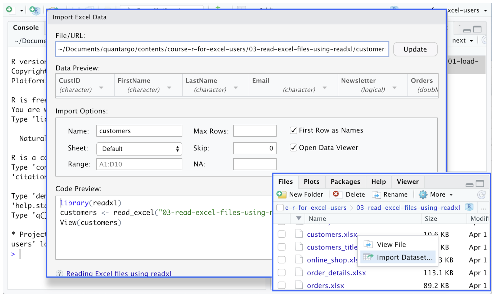
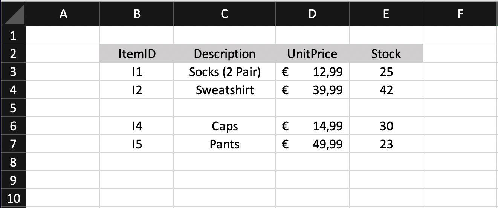
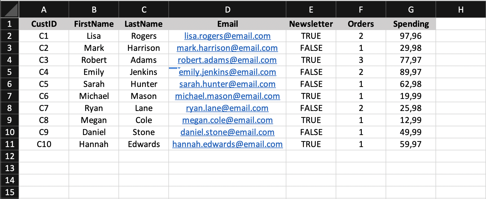
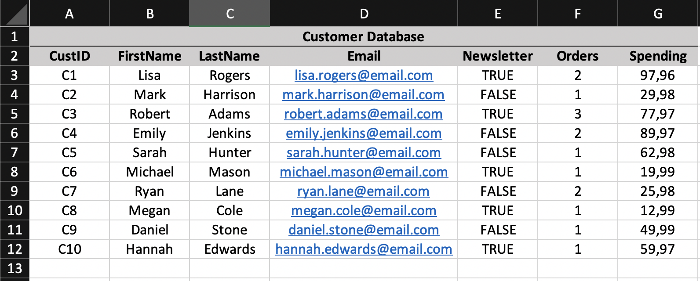
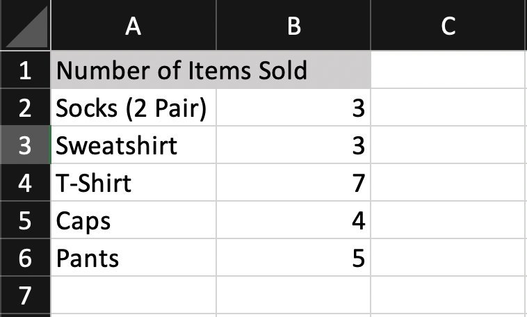

<style>
body {
text-align: justify}
</style>

# Load Excel Files as Data Frames

The <span style="color: green; ">read_excel()</span> function provides an efficient solution to read Excel worksheets as tibbles. It is well integrated into the **RStudio** editor to make data imports from Excel even easier.

- Read Excel worksheets with <span style="color: green; ">read_excel()</span>
- Get familiar with the default settings of <span style="color: green; ">read_excel()</span>
- Use the <span style="color: green; ">skip</span> argument to ignore title rows
- Use the <span style="color: green; ">col_names</span> argument to handle column names

```{r, eval=FALSE}
library(readxl)
read_excel(path = "<filename.xlsx>",
           skip = ___,
           col_names = ___)
```

## Introduction
The <span style="color: green; ">read_excel()</span> function from the *readxl* package probably provides the quickest and most convenient way to read Excel files with R. It can be used for either the <span style="color: green; ">.xlsx</span> or the (old) <span style="color: green; ">.xls</span> file extensions and handles each file format accordingly. In addition, the function sets column names, data types and missing values automatically.

Excel file imports through *readxl* are also directly integrated into the RStudio development environment by just clicking on the file in the *Files* pane:

{}

For these reasons, <span style="color: green; ">read_excel()</span> is one of the most widely used functions for Excel file imports.

## The read_excel() Function

```{r, eval=FALSE}
library(readxl)
read_excel(path = "<filename.xlsx>",
```

After loading the *readxl* package we can read our first excel file by calling the <span style="color: blue; ">read_excel()</span> with the <span style="color: blue; ">path</span> to the document we want to read. As an output, <span style="color: blue; ">read_excel()</span> returns the contents of the spreadsheet as a tibble.

In the following example, we read the Excel file <span style="color: darkred; ">orders.xlsx</span>, containing information about the orders received by an online shop:

```{r}
library(readxl)
read_excel(path = "orders.xlsx")
```

## Spreadsheet Shape
Excel spreadsheets can come in many forms with different layouts. In an optimal case the contents of a spreadsheet are organized in a tabular format with the first row defining the name of each column. Based on these principles, by default the <span style="color: blue; ">read_excel()</span> function will:

- read the smallest possible rectangular area from the spreadsheet that covers all non-empty cells.
- use the first row of content as column names for the output.
- handle empty cells as <span style="color: red; ">NA</span> values.

As an example, let’s take a look at the structure of the following spreadsheet:

{}

```{r}
read_excel(path = "products.xlsx")
```

## Data Types
Apart from automatically finding the relevant area of cells, <span style="color: blue; ">read_excel()</span> will also infer the data types of the columns based on the used Excel data types. Even if different formatting options have been used for numeric values like currencies and percentages <span style="color: blue; ">read_excel()</span> will still interpret them as numeric. This would not be the case for manually typed (string) percentage values since they change the Excel cell type to string and thus are interpreted as characters.

As an example, let’s take a look at the following spreadsheet:

{}
If we read this file using <span style="color: blue; ">read_excel()</span>, each column is assigned to the most suitable data type:


```{r}
read_excel("customers.xlsx")
```

Note, that <span style="color: blue; ">read_excel()</span> cannot automatically identify, whether a column represents a factor variable and instead interprets it as a character. These columns must be manually converted with <span style="color: blue; ">factor()</span> after a spreadsheet has been read.

## Optional Argument: <span style="color: blue; ">*skip*</span>

```{r, eval=FALSE}
library(readxl)
read_excel(path = "<filename.xlsx>",
           skip = ___,
           col_names = ___)
```

Excel files often contain header rows at the beginning of the spreadsheets which shall not be part of the table to be read. For example, the file <span style="color: blue; ">customers_title.xlsx</span> has the following layout:

{}
Reading it with a vanilla <span style="color: blue; ">read_excel()</span> function results in

```{r}
read_excel(path = "customers_title.xlsx")
```

To exclude the first row containing <span style="color: blue; ">Customer Database</span>  we can use the <span style="color:red;" >skip</span>  parameter and define the exact number of rows to be skipped at the beginning of the spreadsheet:

```{r}
read_excel(path = "customers_title.xlsx", skip = 1)
```

## Optional Argument: <span style="color: blue; ">*col_names*</span>

```{r, eval=FALSE}
library(readxl)
read_excel(path = "<filename.xlsx>",
           skip = ___,
           col_names = ___)
```

Another frequent issue is the use of common titles instead of separate names for each column:

{}

```{r}
read_excel(path = "sales.xlsx",
           skip = 1,
           col_names = FALSE)
```

In case you know the appropriate column names, it is also possible to define a character vector with the desired names:

```{r}
read_excel(path = "sales.xlsx",
           skip = 1,
           col_names = c("Item", "UnitsSold"))
```

# Handle Excel Files with Multiple Sheets

The <span style="color: blue; ">read_excel()</span> function can only read one Excel sheet at a time. However, Excel files often contain multiple worksheets. In these cases, we can rely on the <span style="color: blue; ">excel_sheets()</span> function to inspect the available worksheets and instruct <span style="color: blue; ">read_excel()</span> to read the appropriate one.

- Use <span style="color: blue; ">excel_sheets()</span> to retrieve all sheet names from an Excel file
- Use the <span style="color: green; ">sheet</span> parameter in <span style="color: blue; ">read_excel()</span> to read a specific worksheet
- Read all worksheets using an <span style="color: blue; ">sapply()</span> loop

```{r, eval=FALSE}
sheets <- excel_sheets(path = "<filename.xlsx>")
read_excel(path = "<filename.xlsx>",
           sheet = "<sheetname>")
sapply(X = sheets, FUN = readxl, path = "<filename.xlsx>")
```

## Inspect the Available Excel Sheets

```{r, eval=FALSE}
sheets <- excel_sheets(path = "<filename.xlsx>")
#read_excel(path = "<filename.xlsx>",
#          sheet = "<sheetname>")
#sapply(X = sheets, FUN = readxl, path = "<filename.xlsx>")
```

Excel files often contain multiple spreadsheets. These must have unique names in order to make an exact identification and selection possible. In the world of *readxl*, we can use the <span style="color: blue; ">excel_sheets()</span> function to inspect the available spreadsheets in an Excel file. As an output it returns a character vector with their names:

```{r}
library(readxl)
excel_sheets("online_shop.xlsx")
```

## Read a Specific Sheet

```{r, eval=FALSE}
#sheets <- excel_sheets(path = "<filename.xlsx>")
read_excel(path = "<filename.xlsx>",
           sheet = "<sheetname>")
#sapply(X = sheets, FUN = readxl, path = "<filename.xlsx>")
```

Once we know which worksheet we want to read from an Excel file, we have two options. We can either use the name of the worksheet and define it as the sheet parameter:

```{r}
read_excel(path = "online_shop.xlsx",
           sheet = "Orders")
```

Alternatively, we can use the index of the worksheet within the Excel file:

```{r}
read_excel(path = "online_shop.xlsx",
           sheet = 3)
```

## Read All Sheets Using <span style="color: blue; ">*sapply()*</span>

```{r, eval=FALSE}
#sheets <- excel_sheets(path = "<filename.xlsx>")
#read_excel(path = "<filename.xlsx>",
 #          sheet = "<sheetname>")
sapply(X = sheets, FUN = readxl, path = "<filename.xlsx>")
```

In case we want to read all available worksheets from an Excel file, we can make use of a simple loop structure. First we extract the names of the worksheets:

```{r}
sheets <- excel_sheets("online_shop.xlsx")
```

Next we use <span style="color: blue; ">sapply()</span> to interactively read each spreadsheet and return a list containing the spreadsheet table contents as items. For each iteration, <span style="color: blue; ">*sapply*</span> uses a worksheet name from <span style="color: blue; ">*sheets*</span> and reads it through <span style="color: blue; ">read_excel()</span>. To make this possible we also need to define the path to the Excel file:

```{r}
collection <- sapply(X = sheets,
                     FUN = read_excel,
                     path = "online_shop.xlsx")
```

As a result, <span style="color: blue; ">sapply()</span> will return a list of tibbles containing data from all spreadsheets. Afterwards, we can simply select a spreadsheet from the list:

```{r}
collection$Customers
```

Note, that this approach makes it harder to handle individual issues of the spreadsheets and define different <span style="color: blue; ">skip</span> or <span style="color: blue; ">col_names</span> settings for example.

# Read a Specific Range from an Excel Sheet

Excel sheets can contain vast amounts of information, out of which we might only require a specific set of rows and columns. The <span style="color: blue; ">read_excel()</span> function has a <span style="color: red; ">range</span> parameter to restrict data input to a specific range of cells.

- Read only a range of cells using the <span style="color: red; ">range</span> argument
- Apply selector functions to read a range of rows or columns

```{r, eval=FALSE}
read_excel(path = "<filename.xlsx>",
           sheet = "<sheetname>",
           range = "<start>:<end>")
```

## Define a Range Selection

In addition to selecting a specific sheet, we can extend the <span style="color: blue; ">read_excel()</span> function with the <span style="color: red; ">range</span> parameter to read only a given range of cells. Ranges need to be specified using the typical Excel format, defining a rectangular area of cells.

{}

For example, to read the first six rows in column **B** and **C** from the Excel file *online_shop.xlsx* we can use

```{r}
library(readxl)
read_excel(path = "online_shop.xlsx",
           sheet = "Products",
           range = "B1:C6")
```

Note that defining a specific <span style="color: red; ">range</span> will overwrite settings such as <span style="color: red; ">skip</span>. It will read exclusively the area defined by <span style="color: red; ">range</span>, no matter if it contains any content.

## Use Range Selector Functions

Reading a range of rows or columns from an Excel worksheet can be tedious when using an exact cell range definition. We need to know how many rows there are or how many columns there are in order to properly define the range. As a more convenient alternative, we can apply specific selector functions that automatically find all columns for a selection of rows and all observations belonging to a selection of columns.

To read only the first 4 rows, we can use the <span style="color: blue; ">cell_rows()</span> selector function to define the <span style="color: red; ">range</span> of interest:

```{r}
read_excel(path = "online_shop.xlsx",
           sheet = "Products",
           range = cell_rows(1:4))
```

Similarly, to read only the first 2 columns, we can apply the <span style="color: blue; ">cell_cols()</span> selector function:

```{r}
read_excel(path = "online_shop.xlsx",
           sheet = "Products",
           range = cell_cols(1:2))
```

>Coming up <span style="color: green; ">writexl</span> package...


