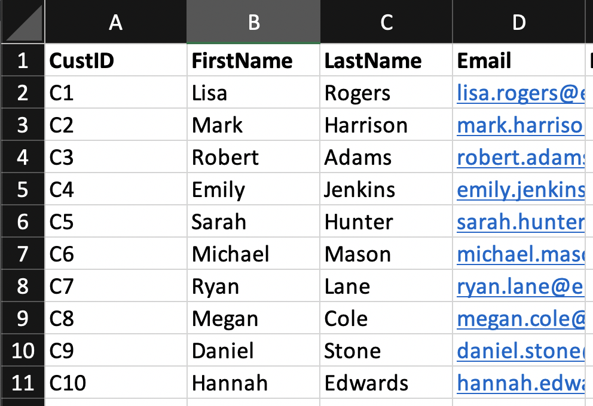
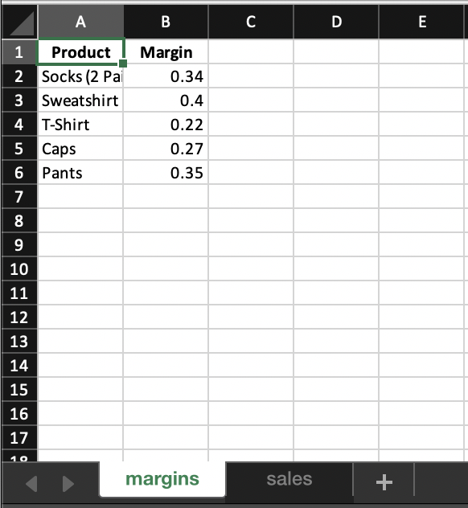

<style>
body {
text-align: justify}
</style>

The  <span style="color: red; ">write_xlsx()</span>  function from the **writexl** package provides a straightforward and efficient way to export data frames as Excel files.

- Use <span style="color: red; ">write_xlsx()</span> to export data frames as Excel files
- Use the <span style="color: red; ">col_names</span> col_names argument to handle column names

```{r eval=FALSE}
write_xlsx(x = <data.frame>,
           path = "<filename.xlsx",
           col_names = TRUE)
```

## The <span style="color: red; ">write_xlsx()</span> Function

```{r eval=FALSE}
write_xlsx(x = <data.frame>,
           path = "<filename.xlsx",
           
```

The *writexl* package is one of the most efficient options when it comes to exporting data frames as Excel worksheets. The <span style="color: red; ">write_xlsx()</span> provides a fast and convenient solution to write Excel files, with only a handful of input parameters. It can be used to export a single data frame as an Excel worksheet, but also to write multiple data frames to an Excel workbook.

The main reason for the popularity of <span style="color: red; ">write_xlsx()</span> is its speed and simplicity. Consider the following tibble, containing the average spending per order for each customer:

```{r echo=FALSE}
library(writexl)
library(readxl)
avgSpending = read_excel("orders.xlsx")
```

```{r}
avgSpending
```

To write `avgSpending` to an Excel file with <span style="color: green; ">write_xlsx()</span>, we only need to define the following two parameters:

1. The data frame object as the argument <span style="color: red; ">x</span>.
2. The <span style="color: red; ">path</span> with the name for the output file.

```{r}
library(writexl)
write_xlsx(x = avgSpending,
           path = "avgSpending.xlsx")
```

{}

Note: that if we define an existing Excel file for the <span style="color: red; ">path</span>, the function will automatically overwrite it.

## Optional Argument: col_names

```{r eval=FALSE}

           col_names = TRUE)
```

By default, the <span style="color: red; ">write_xlsx()</span> function will automatically extract the column names from the data frame and use them as column names for the Excel worksheet as well. However, in certain situations we might want to skip the column names and only write the data entries to an Excel file. In these cases we can change the default setting using the <span style="color: red; ">col_names</span> argument.

Consider the <span style="color: red; ">newsletter_subscriptions</span> tibble with a single column containing the users, who are subscribed to the weekly updates:

```{r echo=FALSE}
newsletter_subscriptions = read_excel("customers.xlsx")
```

```{r}
newsletter_subscriptions
```

If we want to write this tibble to an Excel file but ignore the column names, we must set the <span style="color: red; ">col_names</span> argument to <span style="color: green; ">FALSE</span>:

```{r}
write_xlsx(x = newsletter_subscriptions,
           path = "newsletter_subscriptions.xlsx",
           col_names = FALSE)
```

## Write Multiple Data Frames to an Excel File

The <span style="color: red; ">write_xlsx()</span> function supports the export of multiple data frames to an Excel file. In this case, the data frames need to be collected in a list, with each element inserted as an individual worksheet into the output.

- Use <span style="color: red; ">write_xlsx()</span> to insert multiple data frames into an Excel file
- Specify a (named) list holding all data frames mapping to worksheet names

```{r eval=FALSE}
write_xlsx(x = list(<sheet_name1> = <data.frame1>,
                    <sheet_name2> = <data.frame2>),
           path = "<filename.xlsx")
```

## Export a Workbook from a List of Data Frames

The `write_xlsx()` function enables to write multiple data frames to an Excel file. These will be organized in separate worksheets, forming an Excel workbook.

Consider the tibbles `productMargins` and `itemsSold`:

```{r echo=FALSE}
productMargins = read_excel("sales copy.xlsx")
itemsSold = read_excel("csales.xlsx")
```

```{r}
productMargins
itemsSold
```

To write these tibbles to an Excel file, we must provide them as a list to <span style="color: red; ">write_xlsx()</span>. In addition, we can name the list elements. These names will be used as names for the respective worksheets:

```{r}
library(writexl)
write_xlsx(x = list(margins = productMargins, sales = itemsSold),
           path = "summaries.xlsx")
```

{}


